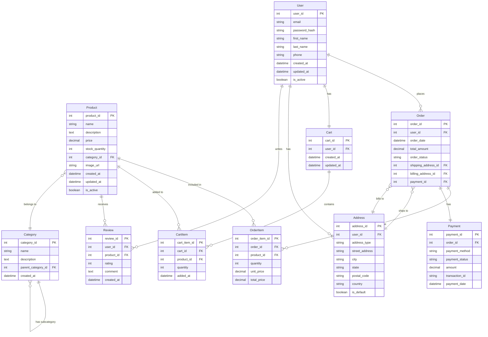

# E-Commerce Website ER Diagram

## Overview
This ER diagram represents the core entities and relationships for a basic e-commerce website, including user management, product catalog, shopping cart, orders, and reviews.

## Core Entities

### 1. User
- **user_id** (PK)
- email
- password_hash
- first_name
- last_name
- phone
- created_at
- updated_at
- is_active

### 2. Product
- **product_id** (PK)
- name
- description
- price
- stock_quantity
- category_id (FK)
- image_url
- created_at
- updated_at
- is_active

### 3. Category
- **category_id** (PK)
- name
- description
- parent_category_id (FK, self-referencing)
- created_at

### 4. Order
- **order_id** (PK)
- user_id (FK)
- order_date
- total_amount
- order_status
- shipping_address_id (FK)
- billing_address_id (FK)
- payment_id (FK)

### 5. OrderItem
- **order_item_id** (PK)
- order_id (FK)
- product_id (FK)
- quantity
- unit_price
- total_price

### 6. Cart
- **cart_id** (PK)
- user_id (FK)
- created_at
- updated_at

### 7. CartItem
- **cart_item_id** (PK)
- cart_id (FK)
- product_id (FK)
- quantity
- added_at

### 8. Address
- **address_id** (PK)
- user_id (FK)
- address_type (shipping/billing)
- street_address
- city
- state
- postal_code
- country
- is_default

### 9. Payment
- **payment_id** (PK)
- order_id (FK)
- payment_method
- payment_status
- amount
- transaction_id
- payment_date

### 10. Review
- **review_id** (PK)
- user_id (FK)
- product_id (FK)
- rating (1-5)
- comment
- created_at

## Mermaid ER Diagram

## Key Relationships

1. **User to Order**: One-to-Many (A user can place multiple orders)
2. **User to Cart**: One-to-One (Each user has one active cart)
3. **User to Address**: One-to-Many (A user can have multiple addresses)
4. **User to Review**: One-to-Many (A user can write multiple reviews)

5. **Product to Category**: Many-to-One (Products belong to categories)
6. **Product to OrderItem**: One-to-Many (A product can be in multiple orders)
7. **Product to CartItem**: One-to-Many (A product can be in multiple carts)
8. **Product to Review**: One-to-Many (A product can have multiple reviews)

9. **Category to Category**: One-to-Many (Self-referencing for subcategories)

10. **Order to OrderItem**: One-to-Many (An order contains multiple items)
11. **Order to Payment**: One-to-One (Each order has one payment)
12. **Order to Address**: Many-to-One (Orders use addresses for shipping/billing)

13. **Cart to CartItem**: One-to-Many (A cart contains multiple items)

## Business Rules

- Users must be registered to place orders
- Products must belong to a category
- Orders must have at least one order item
- Cart items are temporary until checkout
- Reviews require both a user and a product
- Addresses can be reused across multiple orders
- Payments are tied to specific orders
- Categories can have hierarchical structure (parent-child)

## Indexes Recommendations

- user_id on orders, cart, addresses, reviews
- product_id on order_items, cart_items, reviews
- category_id on products
- order_id on order_items, payments
- cart_id on cart_items
- email on users (unique)